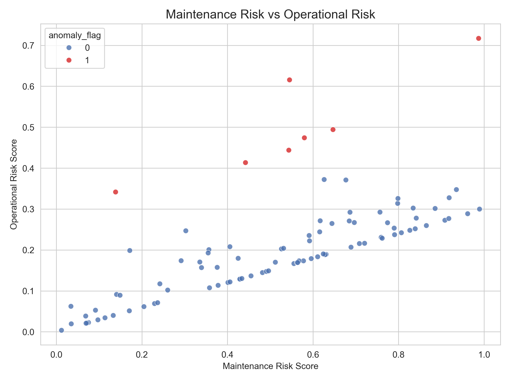
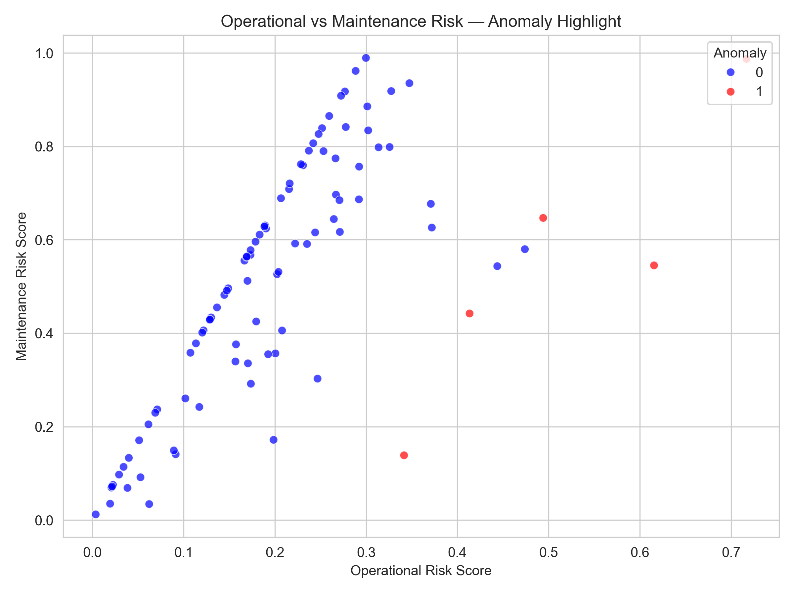
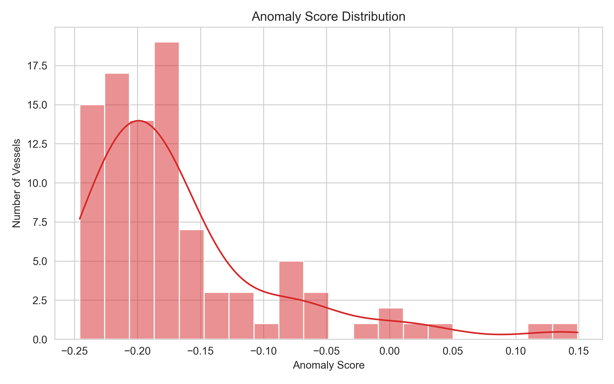
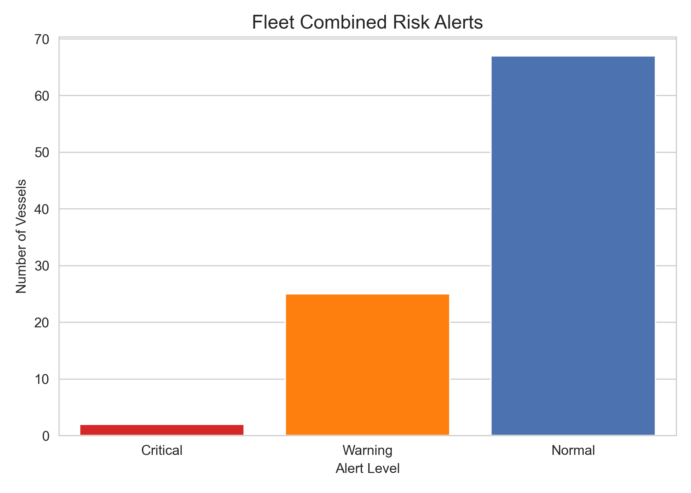
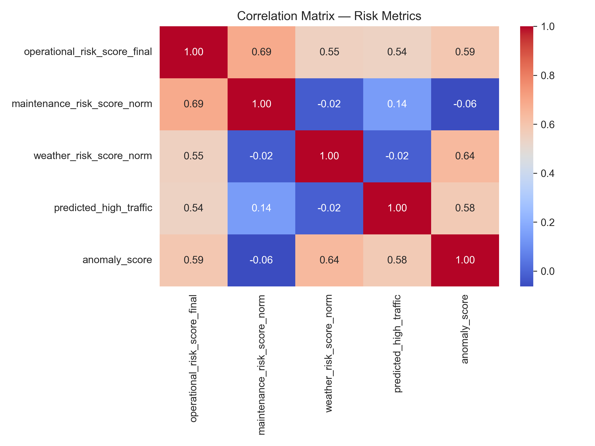
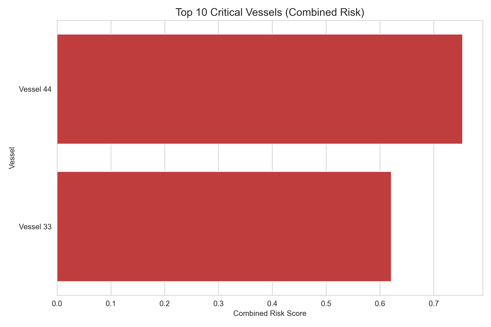

# 🚀 HarborFlow – Maritime Data Intelligence (GIS + AI)

**HarborFlow** is an end-to-end data analytics project that simulates a real-world maritime decision-support system using **GIS, data analytics, and machine learning**.

It transforms raw maritime data (AIS, weather, maintenance) into **actionable insights for operational efficiency, risk monitoring, and anomaly detection**.

---

# 🎯 Business Problem

Maritime operations generate large volumes of complex data, but:

- vessel behavior is difficult to monitor in real time  
- environmental factors impact operations unpredictably  
- risk detection is often reactive rather than proactive  

👉 Companies need **data-driven systems** to improve:
- route efficiency  
- safety and risk monitoring  
- operational decision-making  

---

# 💡 Solution

HarborFlow builds a **data pipeline + analytics system** that:

- integrates AIS, weather, and maintenance data  
- applies geospatial analysis (GIS)  
- models operational and environmental risk  
- detects anomalies using machine learning  

👉 Result: a **fleet-level risk intelligence system**

---

# 🔍 Key Insights (Example Outputs)

- Identification of **high-traffic vessel routes**  
- Detection of **anomalous vessel behavior**  
- Impact of **weather conditions on operations**  
- Prioritization of vessels based on **combined risk score**  

The following visuals highlight key analytical outputs and decision-support insights generated throughout the project:

## 📸 Visual Insights

### 🗺️ Maritime Traffic & Spatial Patterns

*Geospatial visualization of vessel traffic density highlighting high-activity maritime corridors and port congestion patterns.*

---

### 📊 Operational Risk vs Maintenance Behavior

*Relationship between operational risk and maintenance patterns, supporting predictive maintenance insights.*

---

### 🤖 Anomaly Detection (AI Model Output)

*Isolation Forest model identifying anomalous vessel behavior based on operational and maintenance risk signals.*

---

### 📉 Anomaly Score Distribution

*Distribution of anomaly scores used to classify abnormal vessel activity.*

---

### ⚠️ Combined Risk Monitoring

*Integrated risk scoring system combining operational, weather, and maintenance factors into actionable alerts.*

---

### 🔗 Risk Correlation Analysis

*Correlation matrix revealing relationships between key risk variables and system dynamics.*

---

### 🚢 High-Risk Vessel Prioritization

*Identification and ranking of the most critical vessels based on aggregated risk indicators.*

---

# 📊 Why It Matters

This type of system can help maritime organizations:

- reduce fuel and operational costs  
- improve safety and incident prevention  
- prioritize maintenance and inspections  
- support data-driven decision making  

---

# 🧠 Core Capabilities

- 🚢 **AIS Traffic Analysis** → vessel movement & port activity  
- 🌦️ **Weather Impact Analysis** → environmental influence  
- 🛠️ **Maintenance Risk Modeling** → predictive insights  
- 🗺️ **GIS Spatial Analysis** → routes, ports, geographic risks  
- 🤖 **Anomaly Detection** → Isolation Forest model  
- ⚠️ **Risk Scoring System** → unified operational risk indicator  
- 📊 **Fleet Risk Dataset** → structured intelligence output  

---

# 🏗️ Project Architecture

The project is structured as a complete data pipeline:

## Phase 0 — GIS Setup
- Base maps and spatial layers  
- Port infrastructure mapping  

## Phase 1 — Data Analysis (EDA)
- AIS, weather, maintenance exploration  
- statistical analysis and mapping  

## Phase 2 — Data Processing
- cleaning and preprocessing  
- feature engineering  

## Phase 3 — SQL & KPI Layer
- relational schema design  
- KPI extraction  

## Phase 4 — Risk Modeling
- operational + environmental risk scoring  
- dashboard-ready datasets  

## Phase 5 — AI & Anomaly Detection
- Isolation Forest model  
- fleet risk intelligence dataset  

---

# 📊 Key Metrics

- **158 vessels analyzed**  
- **~19,700 AIS records**  
- **744 weather observations**  
- **12 anomalies detected**  

---

# 🧪 Data Sources

- AIS Data — Port of Livorno  
- Weather Data — Open-Meteo API  
- Maintenance Data — simulated dataset  
- Ports Dataset — Natural Earth  

---

# 🛠️ Tech Stack

## Data & Analytics
- Python (Pandas, NumPy)  
- SQL (PostgreSQL)  

## Machine Learning
- Scikit-learn (Isolation Forest)  
- Random Forest  
- XGBoost  

## Geospatial
- ArcGIS Pro  
- GeoPandas  

## Visualization
- Tableau  
- Matplotlib  
- Seaborn  

---

# 📈 Outputs

- 📊 Interactive dashboards (Tableau)  
- 🗺️ GIS visualizations (routes, ports, risk areas)  
- 🤖 anomaly detection results  
- 📁 fleet risk intelligence dataset  

---

# 📂 Repository Structure

HarborFlow_Fresh/
│
├── data/ # Raw, cleaned, and processed datasets
├── docs/ # Technical logs, screenshots, reports
├── maps/ # GIS assets (lightweight)
├── notebooks/ # Jupyter notebooks (analysis & modeling)
├── sql/ # Database schema and queries
├── src/ # Python scripts, helper modules
├── tableau/ # Dashboard outputs
├── venv/ # Virtual environment (ignored by Git)
├── .gitattributes
├── .gitignore
├── LICENSE
└── README.md

---

# 🔬 Methodology

- multi-source data integration  
- feature engineering for risk modeling  
- weighted scoring system  
- unsupervised learning (anomaly detection)  
- visual analytics for interpretability  

---

# 🎯 Applications

- maritime logistics companies  
- port authorities  
- smart port systems  
- geospatial analytics roles  
- data analyst / AI roles in transportation  

---

# 📌 Status

✅ Completed — end-to-end pipeline fully implemented  

---

# 👤 About

This project demonstrates:

- end-to-end data analysis workflow  
- integration of GIS + analytics + machine learning  
- ability to translate data into business insights  

---